### etos-facedetector

- Real-Time Rotation-Invariant Face Detection with Progressive Calibration Networks(PCN). 

### Requirements

- opencv (3.4.3 is tested)

### compile and usage

```
g++ main.cpp -std=c++11 -o etos_facedetector `pkg-config --cflags --libs opencv`
```

```
./etos_facedetector imgs/1.jpg
```

### Demo Results

 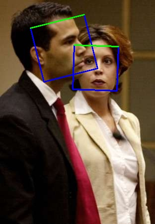
 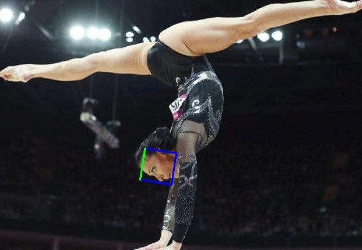
 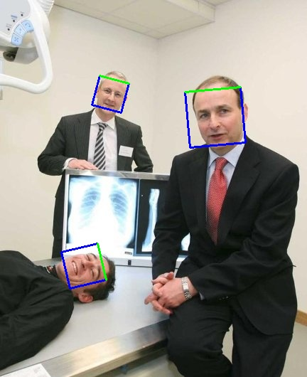
 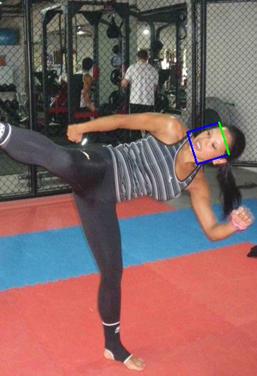
 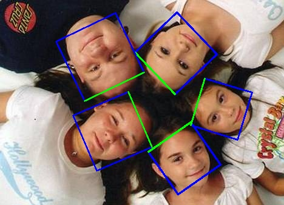
 
 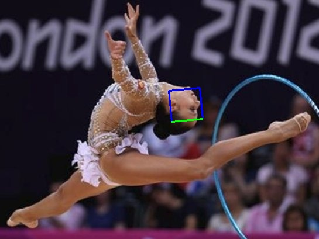
 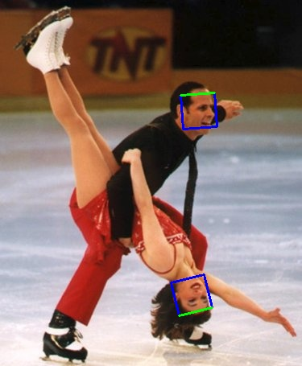
 
 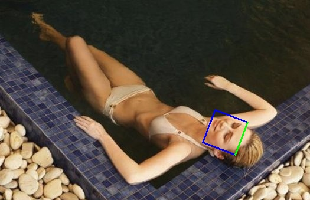
 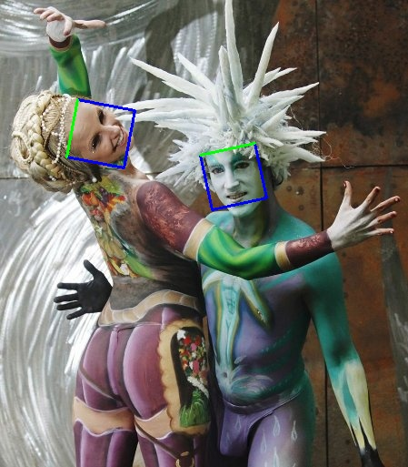
 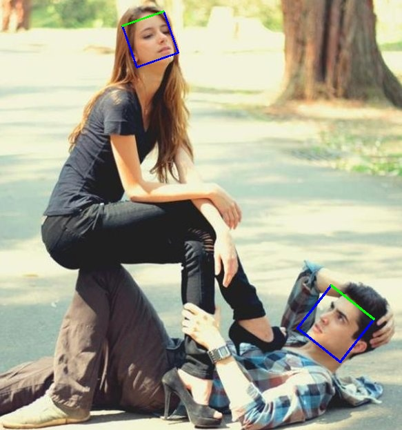
 
 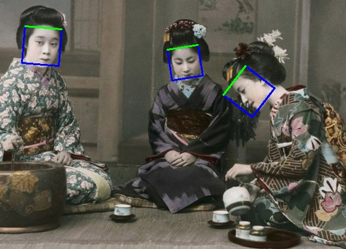
 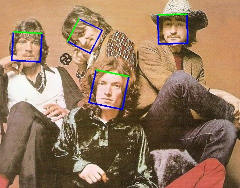
 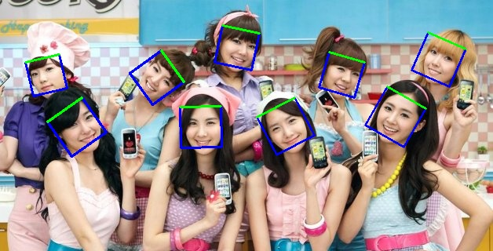
 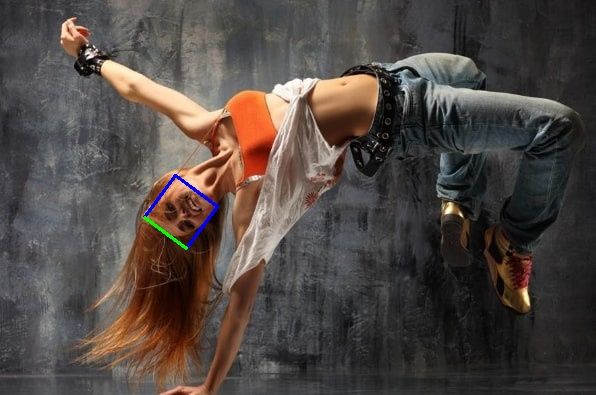
 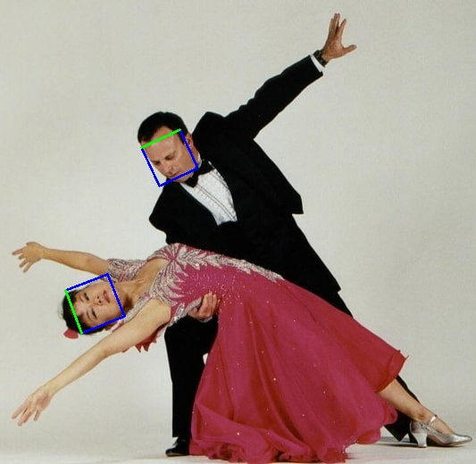
 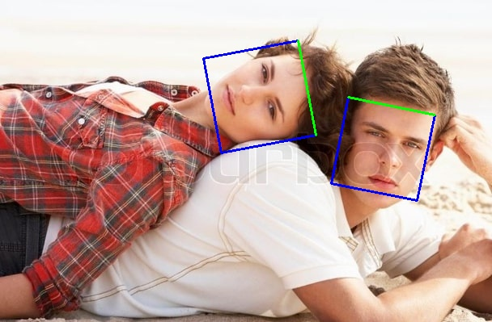
 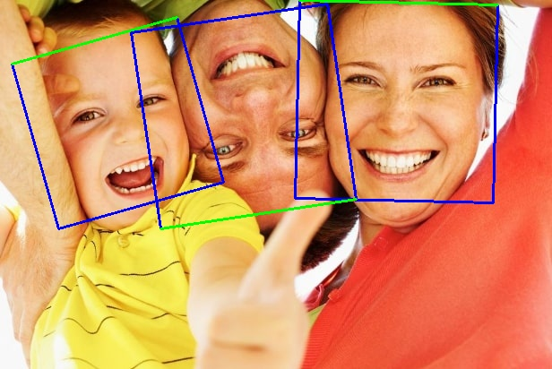
 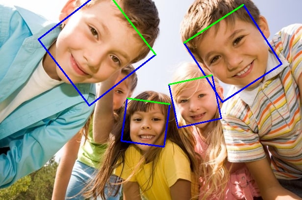
 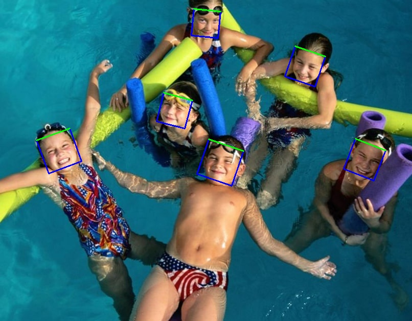
 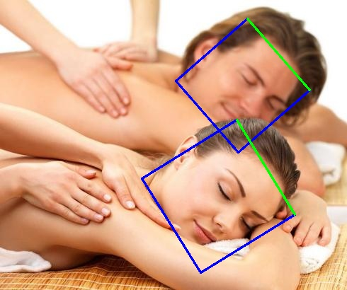
 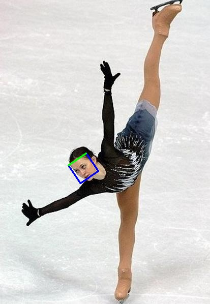
 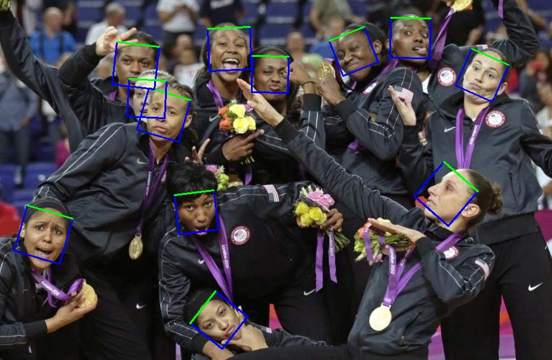
 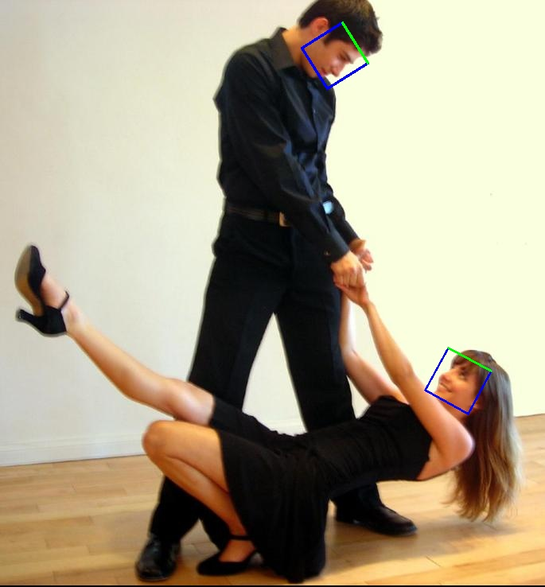

### Thanks 

[PCN-FaceDetection-FaceAlignment](https://github.com/Jack-CV/PCN-FaceDetection-FaceAlignment)
